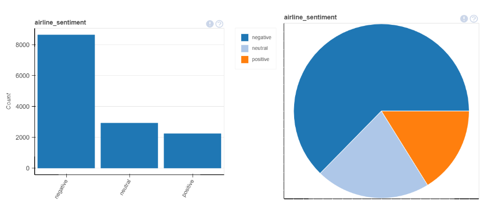
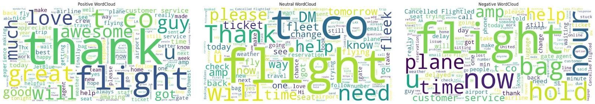
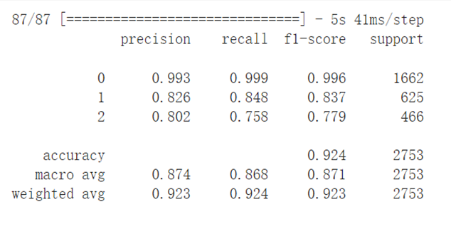
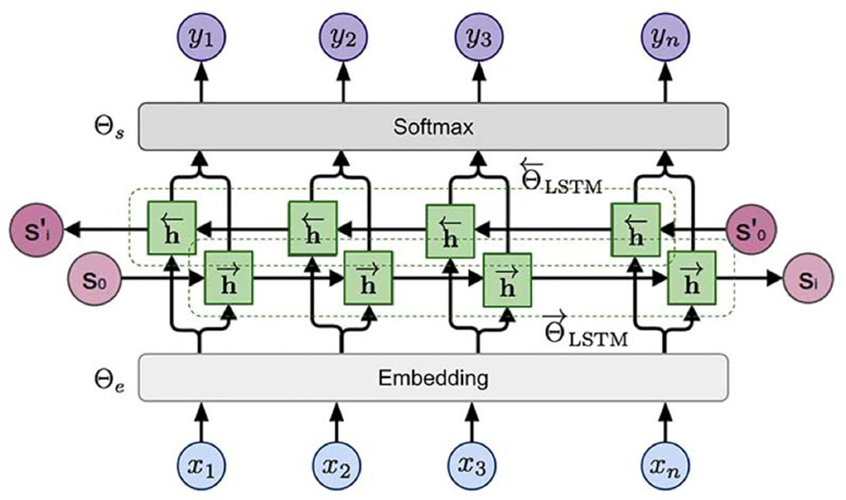
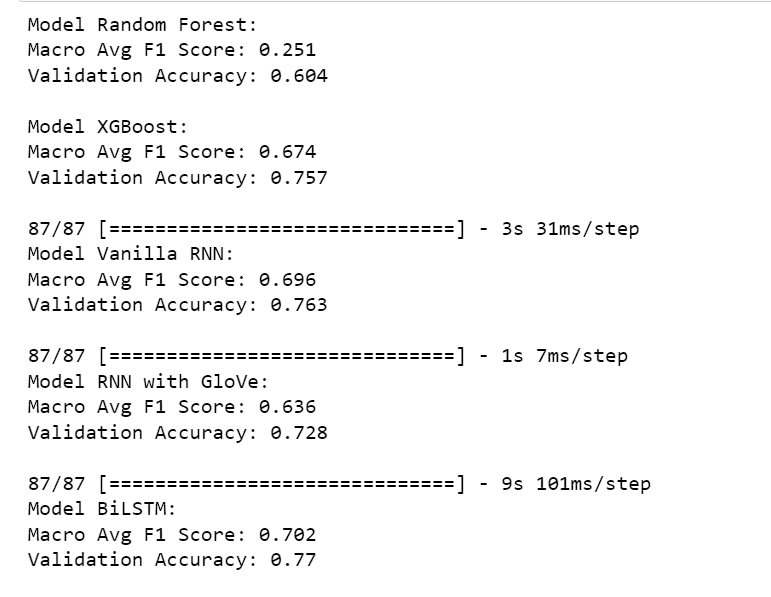

# Airline Customer Sentiment Analysis

## Project Overview
This project automatically classifies airline customer reviews into positive, negative, or neutral sentiment using machine learning and Natural Language Processing (NLP).

## Business Value
The model provides a scalable solution for airlines to analyze vast quantities of customer feedback in real-time. This helps support teams to quickly identify customer "pain points" (e.g., "baggage," "delays," "service") and prioritize responses to negative feedback.

## Final Result (Test Set)
Our champion model (a GloVe-embedded Bi-LSTM) achieved a **Macro F1-Score of 0.86** on the final, unseen test set.

## Technology Stack
* **Language:** Python
* **Data Analysis:** Pandas, NumPy
* **Data Visualization:** Matplotlib, Seaborn
* **NLP:** NLTK, Spacy, Scikit-learn (TF-IDF)
* **Machine Learning:** Scikit-learn (Random Forest, XGBoost)
* **Deep Learning:** TensorFlow, Keras (SimpleRNN, LSTM, Bidirectional LSTM)
* **Word Embedding:** GloVe (Global Vectors for Word Representation)
* **Hyperparameter Tuning:** Optuna

---

## 1. Data Exploration & Preprocessing

### Exploratory Data Analysis (EDA)
The first step was to understand the dataset. EDA revealed two key findings:

1.  **Data Imbalance:** The dataset was heavily imbalanced, with over 60% of all reviews being negative. This confirmed that 'Accuracy' would be a poor metric, and we should prioritize the **Macro F1-Score**.
2.  **Key Pain Points:** Word clouds generated from negative reviews showed that customer complaints were dominated by terms like "flight," "hour" (referring to delays), "bag," and "service."

*Caption: The dataset is dominated by negative reviews (60%+), highlighting the need for a robust F1-Score.*

*Caption: Key drivers for negative sentiment: flight issues, delays (hour), baggage, and customer service.*

### Text Preprocessing Pipeline
To convert raw text into clean, model-ready data, a rigorous preprocessing pipeline was applied:

* **Standardization:** Converted all text to lowercase.
* **Noise Removal:** Used Regular Expressions (Regex) to remove all HTTP links and user handles.
* **Tokenization:** Utilized spaCy to segment sentences into individual words (tokens).
* **Punctuation & Stopword Removal:** Removed all punctuation and common English stopwords (e.g., "the," "is," "a") using the NLTK library.
* **Lemmatization:** Used spaCy to convert words to their base dictionary form (e.g., "running" -> "run"), reducing the vocabulary size and consolidating meaning.

---

## 2. Modeling & Evaluation Strategy
A phased approach was used to benchmark performance, starting with simple models and increasing in complexity.

### Phase 1: Baseline Models
* **Method:** Used TF-IDF vectorization as features for traditional machine learning models.
* **Models:** Random Forest, XGBoost.
* **Result:** XGBoost (Validation F1-Score: **0.674**) significantly outperformed Random Forest, establishing a strong baseline.

### Phase 2: Vanilla Recurrent Neural Network (RNN)
* **Method:** Built a simple RNN and used Optuna for automated hyperparameter tuning.
* **Result:** The simple RNN (Validation F1-Score: **0.696**) outperformed XGBoost, confirming that capturing text sequence was beneficial.

### Phase 3: Advanced Deep Learning (with GloVe)
* **Method:** To give the models a deeper understanding of word meaning, we replaced the simple embedding with pre-trained GloVe (Global Vectors) word embeddings.
* **Models Compared:**
    * SimpleRNN + GloVe (F1: 0.636)
    * LSTM + GloVe (F1: 0.631)
    * **Bidirectional LSTM (Bi-LSTM) + GloVe (F1: 0.702)**
* **Result:** The Bi-LSTM emerged as the top candidate. By reading text both forwards and backwards, it captured the richest context.

### Phase 4: Hybrid Models
* **Method:** We also experimented with a CNN-BiLSTM hybrid model, but its performance (F1: 0.691) did not surpass the standalone Bi-LSTM.

---

## 3. Key Challenge: Identifying & Preventing Data Leakage
A critical part of the analysis was validating our results and identifying data traps.

**The Anomaly:** An early experiment, which included the `negative_reason` field as a feature, produced an unrealistically high validation accuracy of **0.924**.

*Caption: An unrealistically high accuracy of 0.924 was a clear signal of target data leakage.*

**The Diagnosis:** We identified this as a classic case of **target leakage**. The `negative_reason` field is only populated *after* a "negative" sentiment (our `target`) is already known. It is a result of the target, not a predictor.

**The Solution:** We excluded all leaky features (including `negative_reason` and `negative_reason_confidence`) and built our final models only on the `review_text`. This ensured our model's performance was realistic and would generalize to new, unseen data.

---

## 4. Final Model & Results
**Champion Model:** GloVe-embedded Bidirectional LSTM (Bi-LSTM).

**Final Model Architecture:**
* **Embedding Layer:** Loaded 300-dimension GloVe vectors (set to `trainable=False`).
* **Bi-LSTM Layer:** A 64-unit Bidirectional LSTM layer to capture context from both directions.
* **Dropout Layer:** A 0.2 Dropout rate to prevent overfitting.
* **Output Layer:** A Dense layer with `Softmax` activation to output probabilities for the 3 classes (Positive, Neutral, Negative).

*Caption: The final Bi-LSTM model architecture.*

**Performance Comparison:** The Bi-LSTM achieved the highest F1-Score on the validation set, confirming it as the best choice.

*Caption: Final comparison of Validation F1-Scores. The GloVe-embedded Bi-LSTM (0.702) outperformed all other models.*

**Final Performance:** When evaluated on the final, independent Test Set, our tuned Bi-LSTM model achieved a powerful **Macro F1-Score of 0.86**.

---

## 5. Project Code
The complete Python code and analysis are available in the Jupyter Notebook in this repository.
[View the full Jupyter Notebook](./Airline_sentiment_analysis_Code.ipynb)
